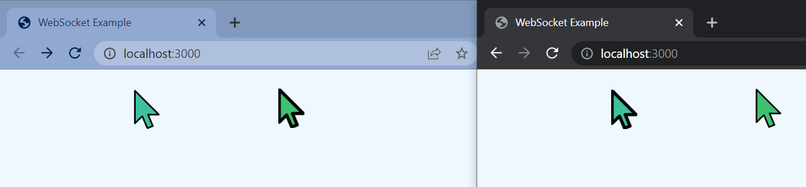

# Example Websocket Projects

## Live Cursor Update

A quick example of Node Express + `ws` Websocket library to show the (x,y) position of all cursors connected to the 
server.

### How to test

1. Git clone this repo
1. `cd live-cursors`
1. `npm install`
1. `npm start`
1. Open Multiple browser tabs/windows to http://localhost:3000/
1. Move the mouse on all of them to see the live updating